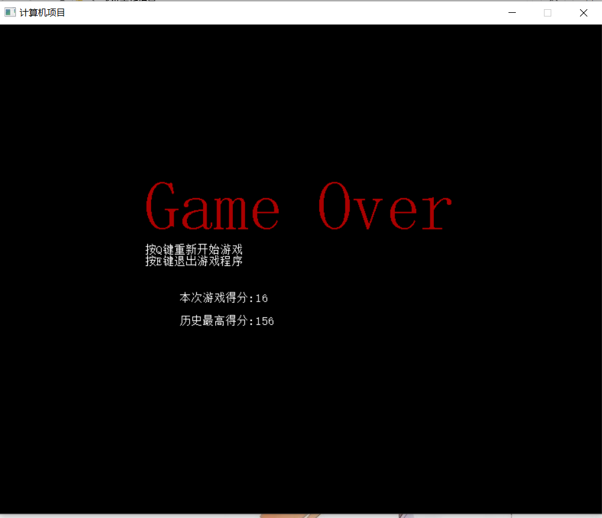
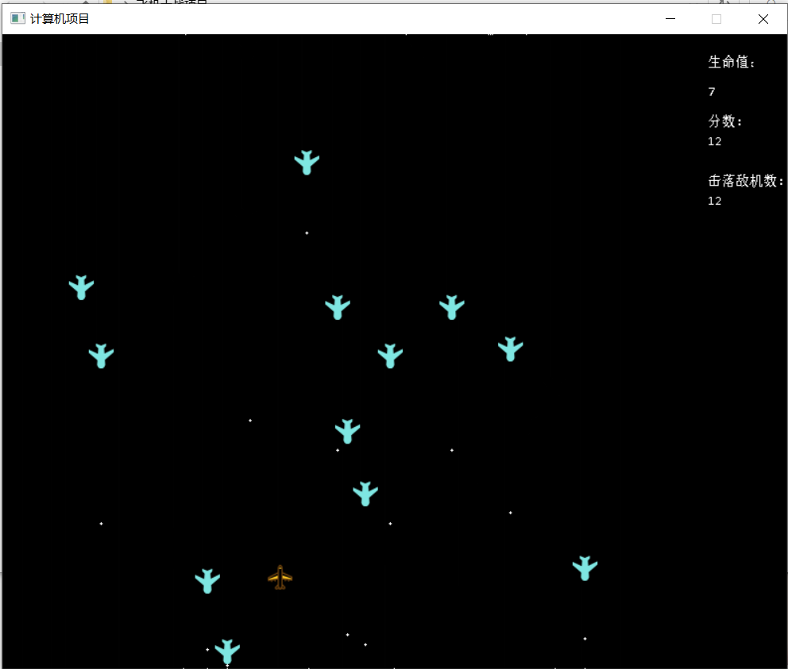
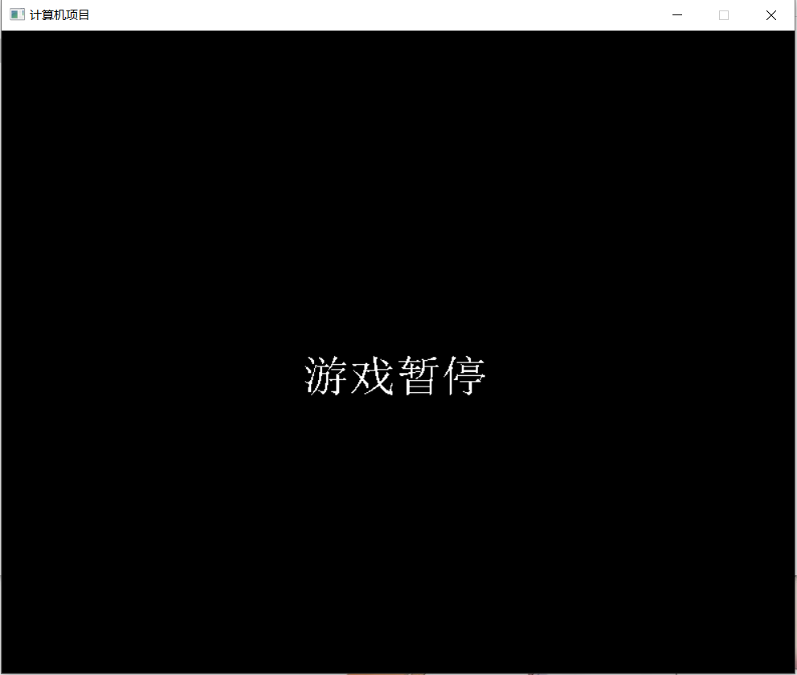

* 目录
[toc]
# 飞机大战(EasyX实现)说明
## 前言：

此项目采用的是面向对象的编程。下面大致叙述主要的类的成员属性和成员函数、以及类与类关系。

```c++
//子弹类
class Bullet
{
public:

	//成员属性
	float position_x;//位置x
	float position_y;//位置y
	float radius;//子弹半径
};
```

```c++
//我方飞机类
class MyPlane
{
public:

	//成员属性
	float position_x;//位置x
	float position_y;//位置y
	int HP;//血量
	Bullet Death01;
	Bullet Death[MyPlaneBulletNum];
	int score;//游戏得分
	int KillEnemyNum;//击落敌机数
};
```

```c++
//敌方飞机类
class EnemyPlane
{
public:

	//成员属性
	float position_x;//位置x
	float position_y;//位置y
	float EnemySpeed;//敌方飞机下落的速度
	Bullet Death02;//子弹类
};
```

```c++
//管理类
class Manager
{
public:
	//构造函数
	Manager();

	//展示界面
	void ShowInterface();

	//与输入无关的更新
	void UpdateWithoutInput();

	//与输入有关的更新
	void UpdateWithInput();

	//判断我方飞机子弹移动
	void MyPlaneBulletMove();

	//判断敌方飞机子弹移动
	void EnemyPlaneBulletMove();

	//判断敌方飞机下落
	void EnemyMove();

	//判断飞机碰撞
	void PlaneCollision();

	//判断我方飞机子弹是否击中敌机
	void Is_EnemyIsHit();

	//判断我方飞机是否被敌机击中
	void Is_MyPlaneIsHit();

	//显示我方飞机HP
	void ShowMyPlaneHP();

	//显示我方飞机得分
	void ShowMyPlaneScore();

	//显示我方飞机击落敌机数
	void ShowMyPlaneKill();

	//判断是否结束游戏得函数
	void Is_EndGame();

	//播放背景音乐
	void PlayBGM();

	//获取最大得分
	int GetMaxScore();

	//成员属性
	MyPlane Asuna;//我方飞机
	EnemyPlane Kirito;//敌方飞机
	EnemyPlane Kirito_01[EnemyMaxNum];//敌方飞机
	vector<int>Scores;//储存分数的容器
};
```

我方飞机类和敌方飞机类中包含子弹类，管理类中包含我方飞机类和敌方飞机类，游戏的主要功能由管理类Manager的成员函数实现。

## 1.界面

### 1.1游戏界面

游戏总界面大小为790×640像素。己方飞机可移动范围、敌方飞机出现范围出现范围均为640×640像素；右侧的150X640像素大小为侧栏，显示玩家的生命值、得分以及击落敌机数。

### 1.2游戏结束界面

游戏结束(我方飞机与敌机相撞或生命值归零)显示Game Over以及玩家此次得分和历史最高得分；玩家按Q键可以开始新游戏，按E键结束游戏。

### 1.3游戏暂停界面

按ESC出现游戏暂停界面，屏幕上出现游戏暂停字样，再次按下ESC可以继续游戏。

## 2.玩法概叙

### 2.1游戏玩法

```c++
void GameExplanation()
{
	cout << "游戏说明" << endl;
	cout << "1.鼠标控制我方飞机移动" << endl;
	cout << "2.按下空格键发射子弹" << endl;
	cout << "3.我方飞机与敌方飞机发生碰撞时游戏结束" << endl;
	cout << "4.我方飞机HP降至0时游戏结束" << endl;
	cout << "5.我方飞机每次被敌方飞机子弹击中后HP减1" << endl;
	cout << "6.我方飞机击中敌方飞机后分数score加1" << endl;
	cout << "7.我方飞机得分每增加20分我方飞机HP加1" << endl;
	cout << "8.按ESC键游戏暂停，再按ESC键游戏继续" << endl;
	cout << "9.游戏结束时显示此次游戏得分和游戏最高得分" << endl;
	cout << "小细节:游戏开始后请将输入法切换为英文模式" << endl;
	system("pause");
}
```

### 2.2补充说明

1.长按空格可以连续发射子弹。

2.每架敌机下落的速度是随机的。

3.击落敌机越快，敌机刷新越快（因为每消失一架敌机就会立即刷新一架新敌机）。

4.我方飞机的得分和生命值都没有上限。

## 3.功能概叙

### 3.1展示界面

```c++
void Manager::ShowInterface()
{
	putimage(this->Asuna.position_x,this->Asuna.position_y, &img_myplane);//展示我方飞机
	//putimage(this->Kirito.position_x,this->Kirito.position_y, &img_enemyplane);//展示敌方飞机

	//展示敌方飞机
	for (int i = 0; i < EnemyMaxNum; i++)
	{
		putimage(this->Kirito_01[i].position_x, this->Kirito_01[i].position_y, &img_enemyplane);//展示敌方飞机
	}

	settextcolor(WHITE);
	settextstyle(15, 0, _T("Consolas"));
	TCHAR a[] = _T("生命值：");
	outtextxy(710, 20, a);
	TCHAR b[] = _T("分数:");
	outtextxy(710, 80, b);
	TCHAR c[] = _T("击落敌机数:");
	outtextxy(710, 140, c);

	//展示我方飞机信息
	this->ShowMyPlaneHP();//显示我方飞机血量
	this->ShowMyPlaneScore();//显示我方飞机得分
	this->ShowMyPlaneKill();//显示我方飞机击落敌机数    

	FlushBatchDraw();//执行批量绘图
}
```

显示我方飞机和敌方飞机，在侧栏显示我方飞机的血量HP、得分Scores以及击落敌机数量。

### 3.2判断我方飞机子弹的移动

```c++
void Manager::MyPlaneBulletMove()
{
	for (int i = 0; i < MyPlaneBulletNum; i++)
	{
		if (this->Asuna.Death[i].position_y > -1)
		{
			clearcircle(this->Asuna.Death[i].position_x, this->Asuna.Death[i].position_y, this->Asuna.Death[i].radius);
			this->Asuna.Death[i].position_y--;
			solidcircle(this->Asuna.Death[i].position_x, this->Asuna.Death[i].position_y, this->Asuna.Death[i].radius);
		}
	}
}
```

我方飞机子弹发射后，以恒定的速度向上移动。

### 3.3判断敌方飞机子弹移动

```c++
void Manager::EnemyPlaneBulletMove()
{

	for (int i = 0; i < EnemyMaxNum; i++)
	{
		if (this->Kirito_01[i].Death02.position_y < High)
		{
			clearcircle(this->Kirito_01[i].Death02.position_x, this->Kirito_01[i].Death02.position_y, this->Kirito_01[i].Death02.radius);//隐藏敌方飞机子弹
			this->Kirito_01[i].Death02.position_y += 1.5 * this->Kirito_01[i].EnemySpeed / 10;
			solidcircle(this->Kirito_01[i].Death02.position_x, this->Kirito_01[i].Death02.position_y, this->Kirito_01[i].Death02.radius);//展示敌方飞机子弹
		}
		else
		{
			//子弹初始化
			this->Kirito_01[i].Death02.position_x = this->Kirito_01[i].position_x + 12.5;
			this->Kirito_01[i].Death02.position_y = this->Kirito_01[i].position_y + 25;
		}
	}
}
```

敌方飞机子弹发射后，以恒定的速度向下移动。

### 3.4判断敌方飞机下落

```c++
void Manager::EnemyMove()
{
	for (int i = 0; i < EnemyMaxNum; i++)
	{
		if (this->Kirito_01[i].position_y < High)
		{
			putimage(this->Kirito_01[i].position_x,this->Kirito_01[i].position_y, &img_enemyplane_mask);//隐藏敌方飞机
			this->Kirito_01[i].position_y += this->Kirito_01[i].EnemySpeed /10;
			putimage(this->Kirito_01[i].position_x,this->Kirito_01[i].position_y, &img_enemyplane);//展示敌方飞机
		}
		else
		{
			this->Kirito_01[i].position_y = 0;
			this->Kirito_01[i].position_x = rand() % Width;
			this->Kirito_01[i].EnemySpeed = rand() % 3 + 1;
		}
	}

}
```

每驾敌方飞机的下落速度是在一定范围内的随机值，并且飞机生成后以这个随机速度匀速下落。

### 3.5判断飞机碰撞

```c++
void Manager::PlaneCollision()
{
	for (int i = 0; i < EnemyMaxNum; i++)
	{
		if (fabs((this->Asuna.position_x + 12.5) - (this->Kirito_01[i].position_x + 12.5)) <= 20
			&& fabs((this->Asuna.position_y + 12.5) - (this->Kirito_01[i].position_y + 12.5)) <= 20)
		{
			this->Scores.push_back(this->Asuna.score);//储存此次游戏的分数
			this->Is_EndGame();
		}
	}
}
```
当我方飞机与敌方飞机物理坐标相同时，判断为我方飞机与敌方飞机相撞，将此次游戏的得分储存到容器中并进入到游戏结束界面。

### 3.6判断我方飞机子弹是否击中敌机

```c++
void Manager::Is_EnemyIsHit()
{
	for (int j = 0; j < MyPlaneBulletNum; j++)
	{
		for (int i = 0; i < EnemyMaxNum; i++)
		{
			//判断我方飞机子弹是否击中敌机
			if (fabs(this->Asuna.Death[j].position_x - (this->Kirito_01[i].position_x + 12.5)) <= this->Asuna.Death[j].radius + 12.5
				&& fabs(this->Asuna.Death[j].position_y - (this->Kirito_01[i].position_y + 12.5)) <= this->Asuna.Death[j].radius + 12.5)
			{
				static int BloodPlus = 0;

				this->Asuna.score++;  
				this->Asuna.KillEnemyNum++;

				//根据得分增加我方飞机血量（无上限）
				BloodPlus++;
				if (BloodPlus >= 20)
				{
					this->Asuna.HP++;
					BloodPlus = 0;
				}

				//处理图像
				clearcircle(this->Asuna.Death[j].position_x, this->Asuna.Death[j].position_y, this->Asuna.Death[j].radius);//隐藏子弹
				putimage(this->Kirito_01[i].position_x, this->Kirito_01[i].position_y, &img_enemyplane_mask);//隐藏敌方飞机

				//重新初始化子弹
				this->Asuna.Death[j].position_x = -1;
				this->Asuna.Death[j].position_y = -1;

				//重新生成敌机
				this->Kirito_01[i].position_y = 0;
				this->Kirito_01[i].position_x = rand() % Width;
			}
		}
	}
}
```

当我方飞机子弹与敌方飞机物理坐标相同时，判断我方飞机击中敌方飞机，擦掉我方飞机子弹和被击中的敌机，我方飞机得分加一，重新初始化敌机和我方飞机的子弹。		

### 3.7判断我方飞机是否被敌机击中

```c++
void Manager::Is_MyPlaneIsHit()
{
	if (this->Asuna.HP <= 0)
	{
		this->Is_EndGame();
	}
	else
	{
		for (int i = 0; i < EnemyMaxNum; i++)
		{
			if (fabs(this->Kirito_01[i].Death02.position_x - (this->Asuna.position_x + 12.5)) <= this->Kirito_01[i].Death02.radius + 12.5
				&& fabs(this->Kirito_01[i].Death02.position_y - (this->Asuna.position_y + 12.5)) <= this->Kirito_01[i].Death02.radius + 12.5)
			{
				this->Asuna.HP -= 1;
				clearcircle(this->Kirito_01[i].Death02.position_x, this->Kirito_01[i].Death02.position_y, this->Kirito_01[i].Death02.radius);//隐藏敌机子弹

				//重新初始化子弹
				this->Kirito_01[i].Death02.position_x = this->Kirito_01[i].position_x + 12.5;
				this->Kirito_01[i].Death02.position_y = this->Kirito_01[i].position_y + 25;
			}
		}
	}
}
```

当敌方飞机子弹与我方飞机物理坐标相同时，判断敌方飞机击中我方飞机，擦掉敌方飞机子弹，我方飞机HP减一，重新初始化敌机子弹。

### 3.8判断是否结束游戏得函数

```c++
void Manager::Is_EndGame()
{
	cleardevice();
	TCHAR s[] = _T("Game Over");
	TCHAR s1[] = _T("按Q键重新开始游戏");
	TCHAR s2[] = _T("按E键退出游戏程序");

	settextcolor(RED);
	settextstyle(90, 0, s);
	outtextxy(Width*0.3, High * 0.3, s);

	settextcolor(WHITE);
	settextstyle(15, 0, s1);
	outtextxy(Width * 0.3, High * 0.3 + 80 + 15 , s1);
	settextstyle(15, 0, s2);
	outtextxy(Width * 0.3, High * 0.3 + 80 + 30 , s2);

	TCHAR sco[5];
	_stprintf_s(sco, _T("%d"), this->Asuna.score);
	outtextxy(AllWidth * 0.3, 350, _T("本次游戏得分: "));
	outtextxy(AllWidth * 0.3 + 100, 350, sco);

	_stprintf_s(sco, _T("%d"), this->GetMaxScore());
	outtextxy(AllWidth * 0.3, 350 + 30, _T("历史最高得分: "));
	outtextxy(AllWidth * 0.3 + 100, 350 + 30, sco);


	FlushBatchDraw();//执行批量绘图

	

	char input = '0';
	while (1)
	{
		input = _getch();
		if (input == 'Q' || input == 'q')
		{
			cleardevice();

			//初始化分数
			this->Asuna.score = 0;
			this->Asuna.KillEnemyNum = 0;

			//我方飞机初始化
			this->Asuna.position_x = Width * 0.5;
			this->Asuna.position_y = High * 0.5;
			this->Asuna.Death01.position_x = -1;
			this->Asuna.Death01.position_y = -1;
			this->Asuna.Death01.radius = MyPlaneBulletRadius;
			this->Asuna.Death01.is_alive = false;
			this->Asuna.HP = 10;
			for (int i = 0; i < MyPlaneBulletNum; i++)
			{
				this->Asuna.Death[i].position_x = -1;
				this->Asuna.Death[i].position_y = -1;
				this->Asuna.Death[i].radius = MyPlaneBulletRadius;
				this->Asuna.Death[i].is_alive = false;
			}

			//敌方飞机初始化
			this->Kirito.position_x = rand() % Width;
			this->Kirito.position_y = 0;
			this->Kirito.EnemySpeed = 1;
			this->Kirito.Death02.position_x = -1;
			this->Kirito.Death02.position_y = -1;
			this->Kirito.Death02.radius = EnemyPlaneBulletRadius;
			this->Kirito.Death02.is_alive = false;
			for (int i = 0; i < EnemyMaxNum; i++)
			{
				this->Kirito_01[i].position_x = rand() % Width;
				this->Kirito_01[i].position_y = 0;
				this->Kirito_01[i].EnemySpeed = rand() % 3 + 1;

				this->Kirito_01[i].Death02.position_x = this->Kirito_01[i].position_x + 12.5;
				this->Kirito_01[i].Death02.position_y = this->Kirito_01[i].position_y + 25;

				this->Kirito_01[i].Death02.radius = EnemyPlaneBulletRadius;
				this->Kirito_01[i].Death02.is_alive = false;
			}
			break;
		}
		else if (input == 'E' || input == 'e')
		{
			exit(0);
		}
	}
}
```

我方飞机与敌方飞机相撞或我方飞机HP归零时游戏结束，并进入游戏结束界面，显示玩家此次游戏得分以及历史最高得分；此外，玩家可通过按键来选择开始新游戏或者结束游戏。

### 3.9获取最大得分

```c++
int Manager::GetMaxScore()
{
	int MaxScore = 0;
	for (vector<int>::iterator it = this->Scores.begin(); it != this->Scores.end(); it++)
	{
		if (MaxScore < *it)//更新最大分数
		{
			MaxScore = *it;
		}
	}
	return MaxScore;
}
```

Manager类得成员属性中有一个用来存储分数的Scores容器，游戏结束时遍历该容器，输出最高得分。

### 3.10初始化操作

```c++
Manager::Manager()
{
	//初始化分数
	this->Asuna.score = 0;
	this->Asuna.KillEnemyNum = 0;

	//初始化画布
	initgraph(AllWidth, AllHigh);

	//图片导入
	loadimage(&img_myplane, _T("myplane.png"), MyPlaneWidth, MyPlaneLength);//导入我方飞机图片(限制图片大小)
	loadimage(&img_myplane_mask, _T("myplane_mask.png"), MyPlaneWidth, MyPlaneLength);//导入我方飞机遮盖图(限制图片大小)
	loadimage(&img_enemyplane, _T("enemyplane.png"), EnemyWidth, EnemyLength);//导入敌方方飞机图片(限制图片大小)
	loadimage(&img_enemyplane_mask, _T("enemyplane_mask.png"), EnemyWidth, EnemyLength);//导入敌方方飞机遮盖图(限制图片大小)

	//我方飞机初始化
	this->Asuna.position_x = Width * 0.5;
	this->Asuna.position_y = High * 0.5;
	this->Asuna.Death01.position_x = -1;
	this->Asuna.Death01.position_y = -1;
	this->Asuna.Death01.radius = MyPlaneBulletRadius;
	this->Asuna.Death01.is_alive = false;

	this->Asuna.HP = 10;

	for (int i = 0; i < MyPlaneBulletNum; i++)
	{
		this->Asuna.Death[i].position_x = -1;
		this->Asuna.Death[i].position_y = -1;
		this->Asuna.Death[i].radius = MyPlaneBulletRadius;
		this->Asuna.Death[i].is_alive = false;
	}

	//敌方飞机初始化
	this->Kirito.position_x = rand() % Width;
	this->Kirito.position_y = 0;
	this->Kirito.EnemySpeed = 1;
	this->Kirito.Death02.position_x = -1;
	this->Kirito.Death02.position_y = -1;
	this->Kirito.Death02.radius = EnemyPlaneBulletRadius;
	this->Kirito.Death02.is_alive = false;
	for (int i = 0; i < EnemyMaxNum; i++)
	{
		this->Kirito_01[i].position_x = rand() % Width;
		this->Kirito_01[i].position_y = 0;
		this->Kirito_01[i].EnemySpeed = rand() % 3 + 1;

		this->Kirito_01[i].Death02.position_x = this->Kirito_01[i].position_x + 12.5;
		this->Kirito_01[i].Death02.position_y = this->Kirito_01[i].position_y + 25;
		
		this->Kirito_01[i].Death02.radius = EnemyPlaneBulletRadius;
		this->Kirito_01[i].Death02.is_alive = false;
	}

}
```

初始化操作时放在Manager类的构造函数中实现的，主要包括：初始化我方飞机得分、初始化画布、将图片导入、初始化我方飞机（飞机的位置、飞机子弹以及子弹半径）和敌方飞机（飞机的位置、下落速度、子弹位置以及子弹半径）

## 4.整体流程概叙

```c++
#include"PlaneGame.h"

IMAGE img_myplane;//我方飞机图片
IMAGE img_myplane_mask;//我方飞机遮盖图
IMAGE img_enemyplane;//敌方飞机图片
IMAGE img_enemyplane_mask;//敌方飞机遮盖图

void test01()
{
	Manager Hsb;//创建一个管理类对象
	//Hsb.PlayBGM();//此功能还不成熟
	BeginBatchDraw();//开始批量绘制图片
	while (1)
	{
		Hsb.ShowInterface();
		Hsb.UpdateWithInput();
		Hsb.UpdateWithoutInput();
	}
	EndBatchDraw();//结束批量绘制图片
}

void GameExplanation()
{
	cout << "游戏说明" << endl;
	cout << "1.鼠标控制我方飞机移动" << endl;
	cout << "2.按下空格键发射子弹" << endl;
	cout << "3.我方飞机与敌方飞机发生碰撞时游戏结束" << endl;
	cout << "4.我方飞机HP降至0时游戏结束" << endl;
	cout << "5.我方飞机每次被敌方飞机子弹击中后HP减1" << endl;
	cout << "6.我方飞机击中敌方飞机后分数score加1" << endl;
	cout << "7.我方飞机得分每增加20分我方飞机HP加1" << endl;
	cout << "8.按ESC键游戏暂停，再按ESC键游戏继续" << endl;
	cout << "9.游戏结束时显示此次游戏得分和游戏最高得分" << endl;
	cout << "小细节:游戏开始后请将输入法切换为英文模式" << endl;
	system("pause");
}

int main()
{
	srand((unsigned int)time(0));//随机数种子
	GameExplanation();
	test01();
	return 0;
}
```

### 4.1main函数

先创建随机数种子，再调用GameExplanation函数，然后调用test01函数。

### 4.2GameExplanation函数

其功能是输出游戏规则和补充说明，让玩家了解游戏玩法。

### 4.3test01函数

先创建一个管理类对象，然后进入循环，开始游戏

### 4.4UpdateWithInput函数

```c++
void Manager::UpdateWithInput()
{
	MOUSEMSG m;//记录鼠标消息
	static int BulletOrder = 0;//记录发射的是那一颗子弹
	while (MouseHit())
	{
		putimage(this->Asuna.position_x,this->Asuna.position_y,&img_myplane_mask);
		m = GetMouseMsg();
		if (m.uMsg == WM_MOUSEMOVE)//鼠标移动时，飞机坐标等于鼠标位置
		{
			//防止飞机飞出边界
			if (0 <= m.x && m.x <= Width - MyPlaneWidth
				&& 0 <= m.y && m.y <= High - MyPlaneLength)
			{
				this->Asuna.position_x = m.x;
				this->Asuna.position_y = m.y;
			}

			
		}
		//else if (m.uMsg == WM_LBUTTONDOWN)//点击鼠标左键发射子弹
		//{
		//使用鼠标左键发射子弹无法实现子弹的连续发射，所以这里我不采用鼠标发射子弹	
		//}
	}
	if (_kbhit())//输入空格发射子弹
	{
		char input = _getch();
		switch (input)
		{
		case ' ':
		{
			if (BulletOrder >= 50)//将子弹的发射顺序置零
			{
				BulletOrder = 0;
			}
			this->Asuna.Death[BulletOrder].position_x = this->Asuna.position_x + 12.5;
			this->Asuna.Death[BulletOrder].position_y = this->Asuna.position_y - 1;
			solidcircle(this->Asuna.Death[BulletOrder].position_x, this->Asuna.Death[BulletOrder].position_y, this->Asuna.Death[BulletOrder].radius);
			BulletOrder++;
			break;
		}

		case 27:
		{
			EndBatchDraw();
			settextstyle(50, 0, _T("Consolas"));
			settextcolor(WHITE);
			cleardevice();
			TCHAR s1[] = _T("游戏暂停");
			outtextxy(Width / 2 - 20, High / 2, s1);
			while (true)
			{
				if (_getch() == 27)
				{
					break;
				}
			}
			settextstyle(50, 0, _T("Consolas"));
			settextcolor(BLACK);
			TCHAR s2[] = _T("游戏暂停");
			outtextxy(Width / 2 - 20, High / 2, s2);
			BeginBatchDraw();
		}
		}
	}

}
```

更新与输入有关的函数，用来判断我方飞机移动和发射子弹以及实现游戏暂停的功能。

### 4.5UpdateWithoutInput函数

```c++
void Manager::UpdateWithoutInput()
{
	//我方飞机子弹移动
	this->MyPlaneBulletMove();

	//判断敌方飞机子弹移动
	this->EnemyPlaneBulletMove();

	//判断我方飞机子弹是否击中敌机
	this->Is_EnemyIsHit();

	//判断我方飞机是否被敌机击中
	this->Is_MyPlaneIsHit();

	//判断我方飞机是否与敌方飞机相撞
	this->PlaneCollision();

	//敌方飞机下落
	this->EnemyMove();
}
```

更新与输入无关的函数，用来判断我方飞机子弹的移动、敌方飞机子弹移动、我方飞机子弹是否击中敌机、我方飞机是否被击中、我方飞机是否与敌机相撞、敌方飞机下落。

## 5.遇到的问题以及解决方法

### 5.1如何实现游戏暂停

```c++
if (_kbhit())//输入空格发射子弹
	{
		char input = _getch();
		switch (input)
		{
		case ' ':
		{
			if (BulletOrder >= 50)//将子弹的发射顺序置零
			{
				BulletOrder = 0;
			}
			this->Asuna.Death[BulletOrder].position_x = this->Asuna.position_x + 12.5;
			this->Asuna.Death[BulletOrder].position_y = this->Asuna.position_y - 1;
			solidcircle(this->Asuna.Death[BulletOrder].position_x, this->Asuna.Death[BulletOrder].position_y, this->Asuna.Death[BulletOrder].radius);
			BulletOrder++;
			break;
		}

		case 27:
		{
			EndBatchDraw();
			settextstyle(50, 0, _T("Consolas"));
			settextcolor(WHITE);
			cleardevice();
			TCHAR s1[] = _T("游戏暂停");
			outtextxy(Width / 2 - 20, High / 2, s1);
			while (true)
			{
				if (_getch() == 27)
				{
					break;
				}
			}
			settextstyle(50, 0, _T("Consolas"));
			settextcolor(BLACK);
			TCHAR s2[] = _T("游戏暂停");
			outtextxy(Width / 2 - 20, High / 2, s2);
			BeginBatchDraw();
		}
		}
	}
```

在更新与输入有关的函数中，按空格键开火，按下ESC键后程序进入死循环，直到再次按ESC键时程序才跳出死循环并继续运行（注：ESC的ASCII编码为27）。

### 5.2飞机超出边界问题

```c++
MOUSEMSG m;//记录鼠标消息
	while (MouseHit())
	{
		putimage(this->Asuna.position_x,this->Asuna.position_y,&img_myplane_mask);
		m = GetMouseMsg();
		if (m.uMsg == WM_MOUSEMOVE)//鼠标移动时，飞机坐标等于鼠标位置
		{
			//防止飞机飞出边界
			if (0 <= m.x && m.x <= Width - MyPlaneWidth
				&& 0 <= m.y && m.y <= High - MyPlaneLength)
			{
				this->Asuna.position_x = m.x;
				this->Asuna.position_y = m.y;
			}

			
		}
	}
```

创建一个MOUSEMSG类型的变量m来记录鼠标消息，获取鼠标的位置信息（获取m.x和m.y），加上条件(0 <= m.x && m.x <= Width - MyPlaneWidth&& 0 <= m.y && m.y <= High - MyPlaneLength)限制，这样当鼠标移出画布时，飞机会停留在画布边缘而不是飞到屏幕外面。

### 5.3如何通过坐标判定结果

#### 5.3.1EasyX下的坐标

在 EasyX 中，坐标分两种：物理坐标和逻辑坐标。

物理坐标：物理坐标是描述设备的坐标体系。坐标原点在设备的左上角，X 轴向右为正，Y 轴向下为正，度量单位是像素。坐标原点、坐标轴方向、缩放比例都不能改变。

逻辑坐标：逻辑坐标是在程序中用于绘图的坐标体系。坐标默认的原点在窗口的左上角，X 轴向右为正，Y 轴向下为正，度量单位是点。默认情况下，逻辑坐标与物理坐标是一一对应的，一个逻辑点等于一个物理像素。

因为在EasyX中的逻辑坐标代表的是左上顶点的坐标，因此在判断飞机与飞机相撞、子弹击中飞机时，要对逻辑坐标进行变换，将其变换到飞机图片的中心。

#### 5.3.2判断飞机相撞

我方飞机横坐标 + 0.5 * 我方飞机宽 == 敌方飞机横坐标 + 0.5 * 敌方飞机宽 && 我方飞机纵坐标 + 0.5 * 我方飞机长 == 敌方飞机纵坐标 + 0.5 * 敌方飞机长为真值时判定为飞机相撞

#### 5.3.3判断子弹击中飞机

|飞机横坐标 + 0.5 * 我方飞机宽 - 子弹横坐标| < 子弹半径 + 飞机宽 * 0.5 && |飞机纵坐标 + 0.5 * 我方飞机长 - 子弹纵坐标| < 子弹半径 + 飞机长* 0.5为真值时判定为子弹击中飞机

### 5.4如何实现子弹连续发射

我方飞机的子弹是一个数组，创建一个静态变量static int BulletOrder，每发射一颗子弹在画布上输出一颗子弹并执行BulletOrder++，当BulletOrder == MyPlaneBulletNum（我方飞机子弹数目）时执行BulletOrder = 0，再次按下空格时可继续发射一连串的子弹。也就是是说，每发射MyPlaneBulletNum颗子弹，就会有一次间断（因为程序运行得非常快，因此间断时间非常短）。

## 6.测试效果

效果图如下：

**游戏结束界面**


**游戏界面**


**游戏暂停界面**


**想具体体验可以运行文件夹中的飞机大战.exe文件(注意不要将文件夹中的图片文件删除或者移动位置，否则程序将无法导入图片)。**